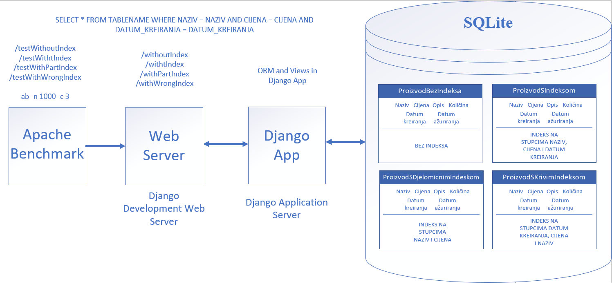

# Benchmark report - Teo Matijašić

---

## Sažetak testiranog koncepta

U ovom benchmarku je testiran koncept konkateniranog (složenog indeksa). To je indeks na tablici u bazi podataka koji uključuje više od jednoga stupca te služi za brže pretraživanje podataka. Time, umjesto da se kreira na jednome stupcu kao i obični indeks, konkatenirani indeks se kreira na više stupaca tablice. Time, ako bi imali tablicu sa stupcima prezime i ime te ako bi često postavljali upite koji uključuju filtriranje po tim stupcima konkatenirani indeks s tim stupcima može poboljšati efikasnost upita. Sami stupci se mogu pojaviti u bilo kojem poretku unutar indeksa, ali da bi se postigla veća efikasnost upiti moraju referencirati sve ili vodeći dio stupaca. Tako bi konkatenirani indeks s stupcima (prezime, ime) mogao efikasno pronaći rezultat upita s određenim prezimenom ili s prezimenom i imenom, ali ne i samo s imenom. Općenito pravilo je da se u konkatenirani indeks prvo stavljaju stupci kojima se najčešće pristupa.

### Kako i Zašto poboljšava sustav?

* kao i običan indeks, konkatenirani indeks služi za brzi pronalazak podataka
* poboljšava sustav jer prvenstveno služi za optimizaciju upita koji uključuju više stupaca
* zbog pohrane kombinacije stupaca, potrebno je manje čitanja na disk od traženja po cijeloj tablici

### Potencijalni problemi s konkateniranim indeksom uključuju:
* veliku ovisnost o prisutnosti određenih stupaca pa odbacivanje određenih stupaca u upitu mogu dovesti do smanjena efikasnosti
* može dovesti do opterećenja održavanja ako uključuje puno stupaca
* dovodi do sporijeg ažuriranja podataka zbog toga što se i on sam treba ažurirati kada se ovisni podaci promijene.
* 
Konkatenirani indeks može pridonijeti u različitim vrstama aplikacija i slučajevima korištenja.  
### Neki od primjera korištenja:
* kada želimo raditi pretragu po više stupaca, na primjer u online trgovinama kada želimo filtrirati proizvode po kategoriji i cijeni.
* aplikacije za praćenje transakcija gdje možemo sortirati transakcije po datumu, količini i sl.
* aplikacije za rezervacije, pronalazak dostupnih soba/stolova prema datumu, lokaciji
* geoprostorni podaci, upiti koji uključuji i zemljopisnu širinu i dužinu

## Arhitektura sustava

